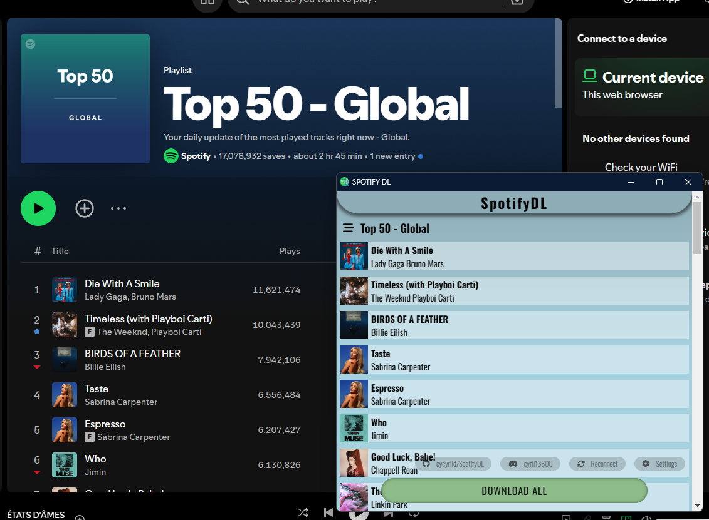

## SpotifyDL Chrome Extension

### Description
Allows users to download Spotify playlist tracks from the browser.

- Using Widevine CDM: Implements Widevine's Content Decryption Module (CDM) to obtain track decryption keys.
- Integrated decryption of the protected file and addition of MP4 metadata with FFmpeg WASM.

**Note: Currently, downloads are in 128kbps quality (Spotify Free quality) due to the absence of a Spotify Premium account for development and testing. Higher quality downloads will be supported in future updates.**



### Features
- Download tracks from Spotify playlists.
- Supports both premium and free Spotify accounts.
- Retrieves and includes complete metadata (album cover, artist, album information).
- Direct download from Spotify servers audio files.

### Installation
1. Clone the repository:
   ```sh
   git clone https://github.com/cycyrild/SpotifyDL.git
   cd SpotifyDL
   ```

2. Install the dependencies:
   ```sh
     npm install
   ```

4. Compile the project:
   ```sh
   npm run proto
   npm run build
   ```

5. Load the extension in Chrome:
   - Open the Chrome browser and navigate to `chrome://extensions/`.
   - Enable "Developer mode" by toggling the switch in the top-right corner.
   - Click on "Load unpacked" and select the directory where the extension files are located (`dist` folder).

### Usage
1. Log in to your Spotify account on the Spotify web player.
2. Navigate to a playlist you want to download.
3. Click on the SpotifyDL extension icon in the Chrome toolbar.
4. The extension will analyze the current page and display the list of tracks available for download.
5. Select the tracks you want to download and click.
6. The selected tracks will be downloaded to your device with complete metadata.


### Disclaimer
This extension is for personal use only. Downloading copyrighted material without permission is against Spotify's terms of service and may violate copyright laws. Use this extension responsibly.
