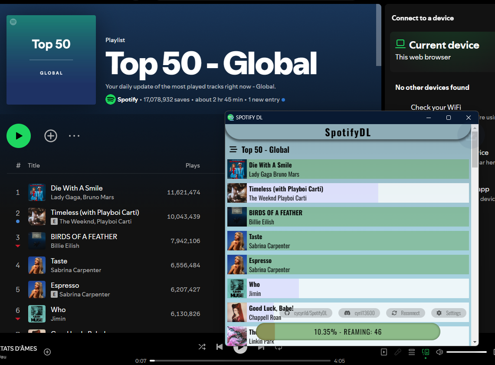
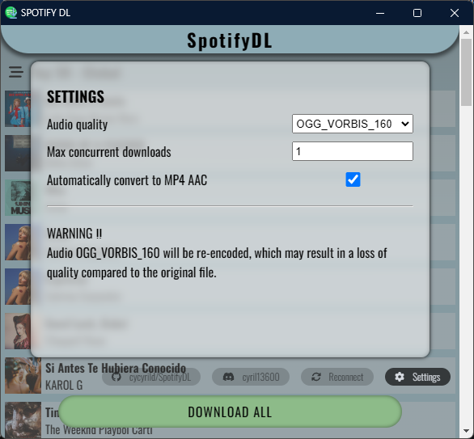

# Spotify downloader Chrome extension


### No longer works.
### Following a DMCA Takedown Notice from Spotify, I have been forced to remove the source code for the PlayPlay CDM.


## Overview

**SpotifyDL** is a Chrome extension that allows users to download tracks, playlists, or albums directly from Spotify via their browser. The extension supports multiple audio formats and provides integrated decryption and metadata management.

> Built using **Manifest V3**, you can review permissions in the `manifest.json` file.

### Key Features

- **Audio Formats Supported:**
  - **Ogg/Vorbis** (96, 160, 320 Kbits/s) via **PlayPlay CDM** ([source](https://github.com/es3n1n/re-unplayplay))
  - **AAC** (128, 256 Kbits/s) via **Widevine CDM**
- **Integrated Decryption:** Decrypts protected files and adds metadata using **FFmpeg WASM**.
- **Parallel Downloads:** Supports downloading multiple files simultaneously for faster processing.

> **Note:** Widevine decryption requires a valid Widevine device, including an RSA Private Key (PEM or DER format) and a Client ID Blob.

For questions, bug reports, or feedback, feel free to contact me on **Discord: cyril13600**.

---

## Project Roadmap

- [x] **PlayPlay** - Migrate decryption from `node-forge` to `WebCrypto` to enhance performance and prevent UI freezing.
- [x] **MP4 AAC** - Add user settings for audio container and codec selection. Users can now choose the audio format when using FFmpeg via the settings interface.
- [ ] **Error Handling** - Improve error logging and implement user-friendly error popups to better inform users of issues.

---

## Installation Instructions

You have two methods to install the extension:

### Option 1: Install from Releases

1. **Download the latest release** from the [releases page](https://github.com/cycyrild/SpotifyDL/releases).
2. **Unzip the file:**  
   After downloading, extract the contents. You should see a folder containing the `dist` subfolder.
3. **Load the extension in Chrome:**
   - Open Chrome and navigate to `chrome://extensions/`.
   - Enable "Developer mode" by toggling the switch in the top-right corner.
   - Click "Load unpacked" and select the `dist` folder containing `manifest.json`.

### Option 2: Build from Source

1. Clone the repository:
   ```sh
   git clone https://github.com/cycyrild/SpotifyDL.git
   cd SpotifyDL
   ```
2. Install dependencies:
   ```sh
   npm install
   ```
3. Compile the project:
   ```sh
   npm run build
   ```
4. Load the extension in Chrome:
   - Open Chrome and navigate to `chrome://extensions/`.
   - Enable "Developer mode" in the top-right corner.
   - Click "Load unpacked" and select the `dist` folder where the compiled files are located.

---

## How to Use

1. Log in to your Spotify account on the web player.
2. Navigate to the track, playlist, or album you wish to download.
3. Click the **SpotifyDL** icon in your Chrome toolbar.
4. The extension will analyze the current page and list all available tracks for download.
5. Select the tracks you want and click to download.
6. The files will be saved to your device with complete metadata, including title, artist, album, etc.

---

## Screenshots





---

## Disclaimer

This extension is intended for personal use only. Downloading copyrighted content without permission is a violation of Spotify's terms of service and may also breach copyright laws. Please use this extension responsibly.

---
